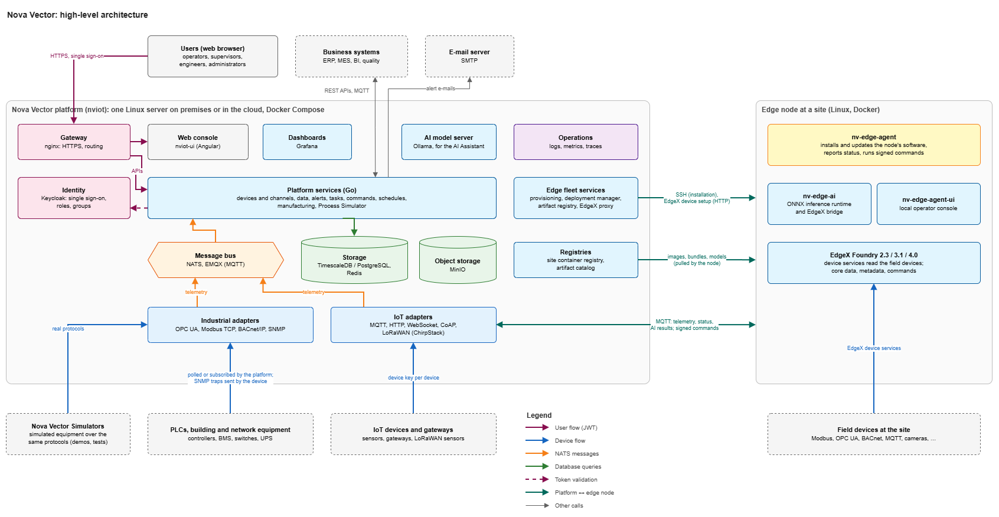
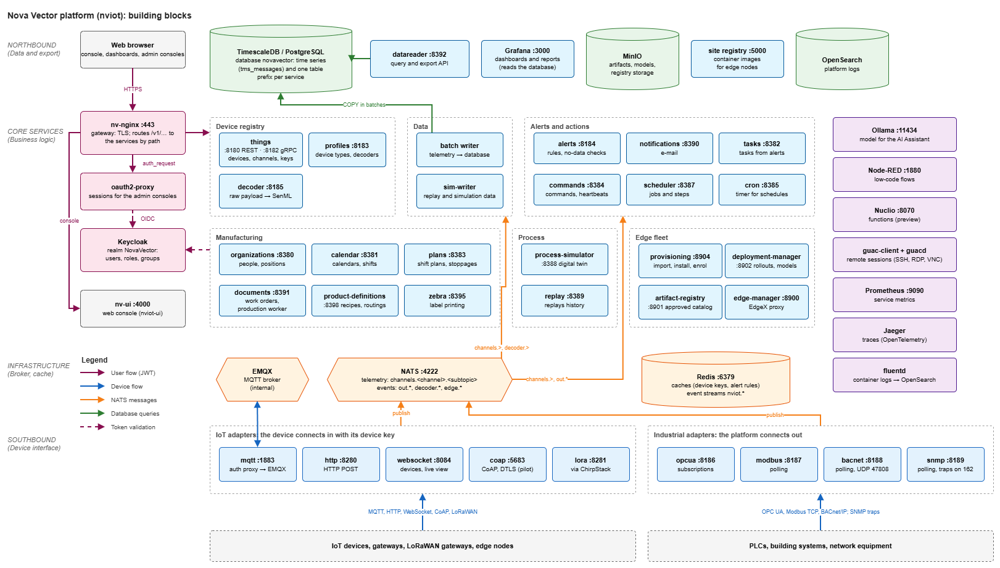
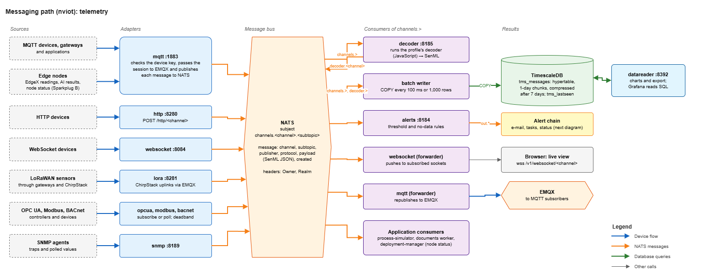
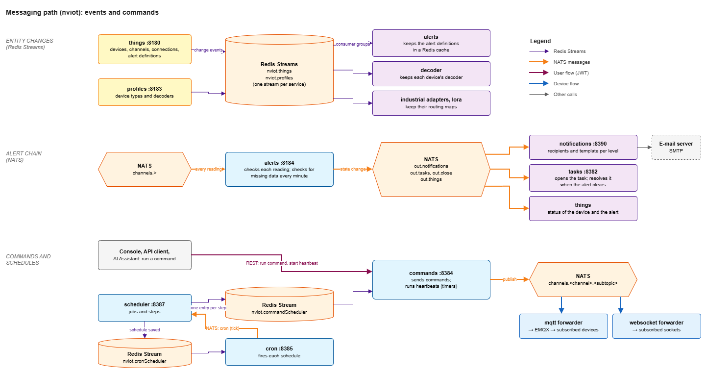
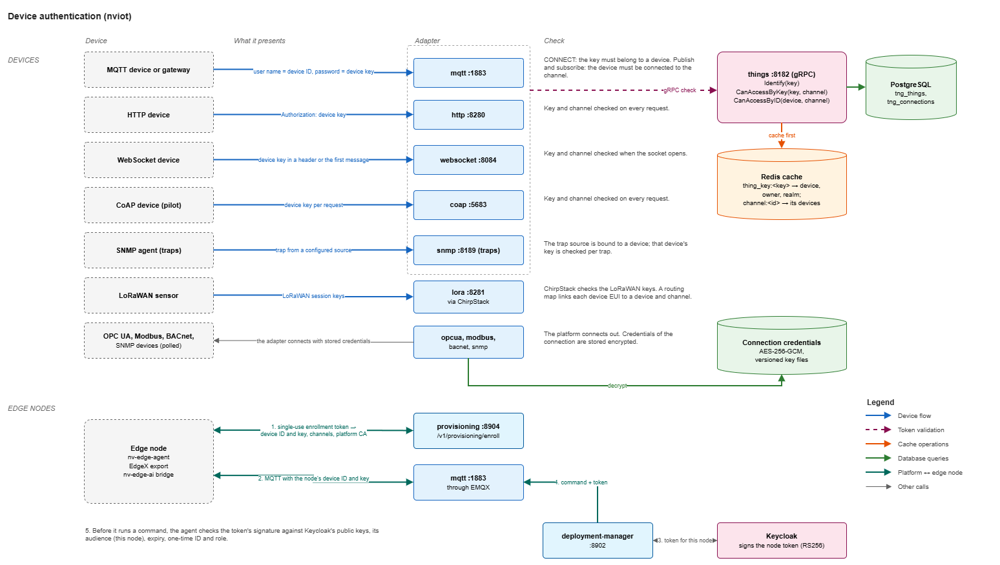
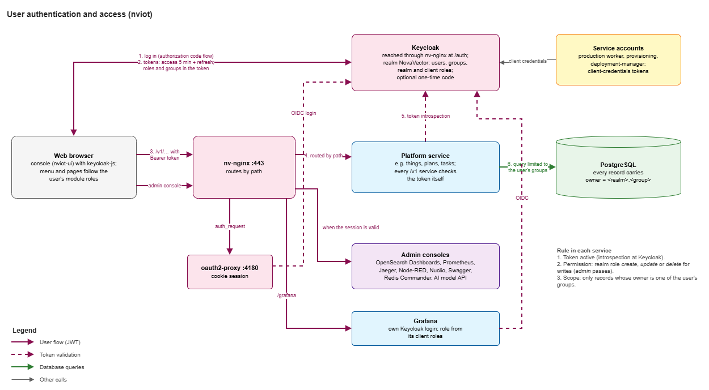

# Nova Vector Platform — Architecture

*October 2026 · for architects, IT and OT teams, and engineers new to the platform*

This document describes how Nova Vector is built. It starts with the whole
system and goes down to the paths that messages and credentials take inside
the platform. Each level has a diagram.

What each feature does for the user is described in the
[Feature Overview](../features/FEATURES.md). Detailed architecture documents for
single services and features are kept in this folder. The first one covers the
[OPC UA adapter](opcua/ARCHITECTURE.md).

> The diagrams are draw.io files in [images/](images/), each with a PNG export.
> To change a diagram, edit its `.drawio` file and export it again, as described
> in the [diagram standards](../diagram-standards.md).

## Contents

1. [High level: the whole system](#1-high-level-the-whole-system)
2. [Mid level: the nviot platform](#2-mid-level-the-nviot-platform)
3. [Messaging path](#3-messaging-path)
4. [Device authentication](#4-device-authentication)
5. [User authentication](#5-user-authentication)
6. [Current scope](#6-current-scope)
7. [Questions for the customer's IT and OT teams](#7-questions-for-the-customers-it-and-ot-teams)
8. [Glossary](#8-glossary)

---

## 1. High level: the whole system

*The platform runs on one server. Edge nodes run at the sites, next to the equipment. Field equipment connects to the platform directly or through an edge node.*

A Nova Vector installation has four parts:

- **The platform (nviot)** runs on one Linux server, on premises or in the
  cloud, as Docker containers. It holds the device registry, all stored data,
  the alerts, tasks and manufacturing records, the web console, and the services
  that manage the edge nodes.
- **Edge nodes** are Linux machines at the sites. Each runs the Nova Vector edge
  agent, which installs and updates the node's software. A node usually also
  runs EdgeX Foundry, which reads the field devices, and can run Edge AI models
  and a local operator console.
- **Field equipment** connects in one of two ways. IoT devices and gateways send
  their data to the platform. The platform's industrial adapters connect out to
  controllers, building systems and network equipment and read them.
- **People and outside systems.** Users work in a web browser. Business systems
  use the REST APIs and MQTT. Alert e-mails go through the customer's e-mail
  server.

### AI in the platform

There are two separate AI functions:

- **Edge AI** runs ONNX models on edge nodes, on the node's live EdgeX data.
  Models are stored in the platform's artifact catalog. They are approved there
  and then deployed to selected nodes. Their results come back as ordinary
  device data.
- **The AI Assistant (preview)** is a chat page in the web console. Its language
  model runs on an Ollama server, either on the platform server or in a
  container next to it. The assistant's logic runs in the user's browser. It
  calls the platform's APIs with the user's own login.

### Registries

- **Artifact catalog:** approved service bundles (EdgeX runtimes, the Edge AI
  runtime, the local console, the simulator systems), edge agent packages and
  AI models. Files are stored in object storage (MinIO).
- **Site container registry:** the container images that edge nodes pull. The
  nodes do not need access to the internet.

### Where each part comes from

| Part | Repository | Runs as |
| --- | --- | --- |
| Platform services, adapters, deployment stacks, edge bundles | `nviot` | Go services, one container each |
| Web console | `nviot-ui` | Angular application served by nginx (container `nv-ui`) |
| Edge agent | `nv-edge-agent` | Native program, a systemd service on the node |
| Local operator console | `nv-edge-agent-ui` | Container on the node, delivered as a bundle |
| Edge AI runtime | `nv-edge-ai` | Two containers on the node: inference runtime and EdgeX bridge |
| EdgeX Foundry 2.3, 3.1 and 4.0 | Open-source EdgeX, packaged as bundles in `nviot/deployments/bundles` | Containers on the node |
| Simulators | `simulators` | Containers on a laptop or lab machine, or as edge bundles |
| Keycloak, NATS, EMQX, Redis, TimescaleDB, MinIO, Grafana, OpenSearch, Prometheus, Jaeger, ChirpStack, Node-RED, Nuclio, Ollama, Guacamole | Open-source images | Containers on the platform server |

### Connections between the platform and an edge node

| Connection | Started by | Protocol |
| --- | --- | --- |
| Telemetry, node status and AI results | Node | MQTT, with the node's device key |
| Commands: deploy, update, roll back, models | Platform, delivered over the node's MQTT session | MQTT, with a signed token per command |
| Software and model downloads | Node | HTTPS (artifact catalog), container registry |
| Installation of the node | Platform | SSH, once per node |
| EdgeX device setup and device replication | Platform | HTTP to EdgeX on the node |
| Local console and EdgeX console opened from the platform | User's browser | HTTP to the node |
| Remote sessions to machines at the site | Platform | SSH, RDP or VNC |

The first three connections are started by the node, so they work through NAT
and firewalls. The other four need the platform, or the user's browser, to
reach the node's address.

### Deployment

The standard installation is Docker Compose on one Linux server. Optional
modules are switched on with Compose profiles: `opcua`, `modbus`, `bacnet`,
`snmp`, `lora`, `edge` (edge fleet services, object storage and site registry),
`extras` (Node-RED, remote sessions, API browser), `monitoring` (Prometheus)
and `ollama-container`. All platform containers share one Docker network.
Kubernetes installations are delivered for each project. See
[Deployment options](../features/13-deployment-options.md).

## 2. Mid level: the nviot platform

*The platform in layers, following the [diagram standards](../diagram-standards.md): devices at the bottom, then the message bus and cache, the services, and storage at the top. Access and identity are on the left, operations tools on the right.*

### Access

| Component | Role |
| --- | --- |
| `nv-nginx` (port 443) | The only web entry point. It ends TLS and routes each path to its service, for example `/v1/things` to the things service. |
| Keycloak | Single sign-on for users, roles and groups (realm `NovaVector`). Reached at `/auth`. |
| oauth2-proxy | Gives the administration consoles a login session. |
| `nv-ui` | The web console, an Angular single-page application. |

### Device interface (adapters)

| Adapter | Port | Direction | Protocol |
| --- | --- | --- | --- |
| mqtt | 1883 | Device connects in | MQTT, passed on to the EMQX broker |
| http | 8280 | Device connects in | HTTP POST |
| websocket | 8084 | Device connects in | WebSocket |
| coap (pilot) | 5683/udp | Device connects in | CoAP |
| lora | 8281 | ChirpStack forwards | LoRaWAN through ChirpStack |
| opcua | 8186 | Platform connects out | OPC UA subscriptions |
| modbus | 8187 | Platform connects out | Modbus TCP polling |
| bacnet | 8188, 47808/udp | Platform connects out | BACnet/IP polling |
| snmp | 8189, traps on 162/udp | Both | SNMP polling and traps |

The industrial adapters (OPC UA, Modbus, BACnet) can run as several instances.
The instances share the work through leases kept in the database. When one
instance stops, the others take over its connections.

### Message bus and cache

- **NATS** carries all telemetry and the platform's internal events. It is used
  without persistence (core NATS).
- **EMQX** is the MQTT broker. Devices never reach it directly: the mqtt adapter
  checks each device and then passes the session on to EMQX.
- **Redis** holds caches (device keys, alert definitions, adapter routing maps)
  and the event streams that announce changes to devices, profiles and
  schedules.

### Services

| Group | Service (port) | Responsibility |
| --- | --- | --- |
| Device registry | things (8180 REST, 8182 gRPC) | Devices, channels and the connections between them; device keys; device authentication for the adapters |
| | profiles (8183) | Device types (profiles), properties and payload decoders |
| | decoder (8185) | Runs a profile's decoder on raw payloads and turns them into SenML |
| Data | batch writer (`timescaledb-batch-writer`) | Writes telemetry to TimescaleDB in batches |
| | sim-writer | The same writer, for replayed and simulated data |
| | datareader (8392) | Query, aggregation and export API for stored data |
| Alerts and actions | alerts (8184) | Evaluates alert rules on every reading, and checks for missing data |
| | notifications (8390) | Sends alert e-mails with a template per alert level |
| | tasks (8382) | Tasks, opened and resolved by alerts or created by people |
| | commands (8384) | Device commands and repeating heartbeats |
| | scheduler (8387), cron (8385) | Jobs and their steps, and the timer that fires them |
| Manufacturing | organizations (8380), calendar (8381) | People and positions; calendars and shifts |
| | plans (8383) | Shift plans, stoppages and production records |
| | documents (8391) | Work orders. Its production worker counts production from machine data. |
| | product-definitions (8398) | Materials, recipes and routings |
| | zebra (8395) | Label templates and printing on Zebra printers |
| Process | process-simulator (8388) | The process digital twin: live mode, state history, rules |
| | replay (8389) | Replays stored data through a copy of a process |
| Edge fleet | provisioning (8904) | Fleet import, installation over SSH, node enrolment |
| | deployment-manager (8902) | Node types, rollouts, and Edge AI model deployments |
| | artifact-registry (8901) | Catalog of bundles, agent packages and models, with approval |
| | edge-manager (8900) | Reads and changes EdgeX devices and profiles on the nodes |

### Storage and export

- **TimescaleDB / PostgreSQL:** one database server. The `novavector` database
  holds the data of all services. Each service uses its own table prefix, for
  example `tng_` for the things service and `pln_` for plans. Telemetry is kept
  in the `tms_messages` hypertable. Keycloak, Grafana and ChirpStack have their
  own databases on the same server.
- **Grafana** reads the database directly for dashboards and reports.
- **MinIO** stores artifacts and models, and the site registry's images.
- **OpenSearch** stores the platform's logs.

### Operations tools

| Tool | Purpose |
| --- | --- |
| fluentd → OpenSearch, OpenSearch Dashboards | Logs of all containers, searchable in one place |
| Prometheus | Metrics that the services publish at `/metrics` |
| Jaeger | Traces that the services send over OpenTelemetry |
| Node-RED, Nuclio (preview) | Low-code flows and serverless functions |
| guac-client and guacd | Remote sessions (SSH, RDP, VNC) in the browser |
| Ollama | Language model for the AI Assistant |

### How the services are built

All platform services follow the same pattern:

- Written in Go, with go-kit for the HTTP layer.
- Each service has its own HTTP port. Most also have `/version`, and `/metrics` for Prometheus.
- Configuration comes from `NV_*` environment variables.
- Each service owns its tables, marked by its table prefix.
- Most services announce their changes on their own Redis event stream, `nviot.<service>`.
- Each service is built as a minimal container image, `novavector/<service>:<version>`.

### Technology

| Area | Technology |
| --- | --- |
| Services | Go 1.26, go-kit, gRPC, NATS client, go-redis, sqlx and pgx |
| Web console | Angular 16, Nebular, PrimeNG, ECharts, Leaflet |
| Identity | Keycloak 24 |
| Messaging | NATS 2.10, EMQX 5.4, Redis 7.2 |
| Storage | TimescaleDB 2.14 on PostgreSQL 16, MinIO |
| Dashboards | Grafana 11.2 |
| Observability | OpenSearch 1.3 with fluentd, Prometheus 3.2, Jaeger 1.54 |
| Gateway | nginx 1.27 |
| Edge | EdgeX Foundry 2.3, 3.1, 4.0; ONNX models |

## 3. Messaging path

### 3.1 Telemetry

*Every reading takes the same path: an adapter puts it on NATS, and several services read it from there.*

1. **A device sends a reading**, or an industrial adapter reads one. The adapter
   checks the device first (see [Device authentication](#4-device-authentication)).
2. **The adapter publishes one message on NATS.** The subject is
   `channels.<channel>`, or `channels.<channel>.<subtopic>` when the device
   sends to a subtopic. The message carries:
   - the channel and subtopic;
   - the publisher (the device's ID);
   - the protocol;
   - the payload;
   - the time it was created.

   Its headers carry the owner group and the realm.
3. **Several services read every message** (subject `channels.>`):

   | Consumer | What it does with the message |
   | --- | --- |
   | decoder | If the device's profile has a decoder, it runs the decoder and publishes the result as SenML on `decoder.<channel>` |
   | batch writer | Stores the readings in TimescaleDB, both direct SenML and decoded readings |
   | alerts | Checks the readings against the device's alert rules, and records that the device is alive |
   | websocket | Pushes the message to browsers and devices that follow the channel |
   | mqtt | Republishes the message to EMQX, for MQTT clients that subscribed to the channel |
   | process-simulator | Moves the live process model when its input signals change |
   | documents (production worker) | Counts good, scrap and rework pieces for running work orders |
   | deployment-manager | Reads edge node status from the nodes' control messages |

4. **Storage.** The batch writer writes every 100 ms or every 1,000 rows,
   whichever comes first. It uses PostgreSQL `COPY`. Each value becomes one row
   in `tms_messages`, with its time, device, channel, name, unit and value.
   - The table is a TimescaleDB hypertable with one-day chunks. Chunks are
     compressed after seven days.
   - No data is deleted automatically. Retention is set for each project.
   - A second table, `tms_lastseen`, keeps the latest value of each signal.
5. **Reading the data.** The console's charts and the data export use the
   datareader API. Grafana reads the tables directly.
6. **Live view.** The console opens a WebSocket for the channel it shows and
   receives each new message as it arrives. If the connection fails, it polls
   the datareader instead.

**Payload format.** Readings are SenML JSON (RFC 8428). A record without a time
gets the time of arrival. Payloads in other formats (EdgeX events, LoRaWAN
payloads, vendor JSON) are turned into SenML by the decoder of the device's
profile.

### 3.2 Events and commands

*Changes to devices and profiles travel on Redis Streams. Alert results and commands travel on NATS.*

**Changes to records.** When a device, channel, connection or profile changes,
its service adds an event to its Redis stream (`nviot.things`,
`nviot.profiles`, …). Services that keep their own copy read these streams as
consumer groups and update their copy:

- the alerts service keeps the alert definitions;
- the decoder keeps each device's decoder;
- the industrial and LoRaWAN adapters keep their routing maps.

**Alert chain.** When an alert changes state, the alerts service publishes:

| Subject | Read by | Result |
| --- | --- | --- |
| `out.notifications` | notifications | E-mail to the recipients of that alert level |
| `out.tasks` | tasks | A new task for the alert |
| `out.close` | tasks | The alert's task is resolved when the alert clears |
| `out.things` | things | The status of the device and of the alert is updated |

A separate check runs every minute and raises a *no data* alert for each device
that has stopped reporting.

**Commands.** A command starts in one of three ways:

- **From the console or an API client**, with `POST /v1/commands/<id>`. The AI
  Assistant runs commands the same way.
- **As a heartbeat:** a timer in the commands service repeats the command.
- **From a schedule.** The scheduler hands each schedule to cron, through the
  `nviot.cronScheduler` stream. On each tick, cron publishes `cron` on NATS. The
  scheduler then adds each step of the job to the `nviot.commandScheduler`
  stream, and the commands service picks it up.

In each case the commands service publishes the command on NATS, on the
channel's subject. The mqtt and websocket adapters deliver it to the devices
that subscribed to that channel. The batch writer stores it like any other
message.

**Edge node control.** Edge nodes use MQTT Sparkplug B on their own control
channel:

- A node reports its state with birth and data messages (`NBIRTH`, `NDATA`).
- The deployment-manager sends commands (`NCMD`) through EMQX. Each command
  carries a signed token (see [Edge nodes](#edge-nodes)).

**Server-sent events.** The process simulator and the heartbeat status page
push their updates to the browser over server-sent events.

### Subjects and streams

| Name | Type | Producer → consumers |
| --- | --- | --- |
| `channels.<channel>.<subtopic>` | NATS | Adapters, commands → writer, alerts, decoder, forwarders, process simulator, production worker, deployment-manager |
| `decoder.<channel>` | NATS | decoder → writer |
| `out.notifications`, `out.tasks`, `out.close`, `out.things` | NATS | alerts, process simulator → notifications, tasks, things |
| `cron` | NATS | cron → scheduler |
| `edge.mgmt.*`, `edge.ai.*` | NATS | artifact-registry, deployment-manager: approval and deployment status events |
| `nviot.things`, `nviot.profiles` | Redis Stream | things, profiles → alerts, decoder, adapters |
| `nviot.cronScheduler` | Redis Stream | scheduler → cron |
| `nviot.commandScheduler`, `nviot.heartbeatScheduler` | Redis Stream | scheduler, process simulator → commands |
| `nviot.<service>` | Redis Stream | Every service; a record of its changes |

## 4. Device authentication

*Devices that connect in present a device key. For industrial equipment the platform connects out, with credentials stored in the connection. Edge nodes enrol once and then use a device key and signed command tokens.*

### Device identity

Every device registered in the platform gets an ID and a **device key**. The
platform generates both. A device belongs to one group (its *owner*). It may
send and receive only on the channels it is connected to.

The things service stores the devices, channels and connections in PostgreSQL.
It also keeps a cache in Redis that maps each key to its device and owner.
Adapters check the cache first, and ask the things service over gRPC when the
key is not in it.

### Checks per protocol

| Protocol | The device presents | What is checked |
| --- | --- | --- |
| MQTT | User name = device ID, password = device key | At connect: the key belongs to a device. At publish and subscribe: the device is connected to the channel. |
| HTTP | Device key in the `Authorization` header | Key and channel, on every request |
| WebSocket | Device key in a header or in the first message | Key and channel, when the connection opens |
| CoAP (pilot) | Device key on each request | Key and channel, on every request |
| SNMP traps | The trap comes from a configured source | The device bound to that source, and its key, on every trap |
| LoRaWAN | LoRaWAN session keys | ChirpStack checks the device. A routing map links each device EUI to a device and channel in the platform. |
| OPC UA, Modbus TCP, BACnet/IP, SNMP polling | Nothing: the platform connects out | The connection's settings name the device and channel. The connection's credentials (OPC UA user or certificate, SNMPv3 user) are stored encrypted with AES-256-GCM, under versioned key files. |

Every message that an adapter publishes carries the owner of its device. This is
how alerts, stored data and the data API stay within the device's group.

### Edge nodes

1. **Enrolment.** The installation script runs on the node with a single-use
   enrolment token. The node presents the token to the provisioning service and
   receives:
   - its device ID and key;
   - its control channel and the MQTT broker's address;
   - the platform's CA certificate;
   - the address of Keycloak.
2. **Data and status.** The agent connects over MQTT with the node's device ID
   and key. The EdgeX export and the Edge AI bridge use the same identity.
3. **Commands.** For each command, the deployment-manager asks Keycloak for a
   new token issued for that node. The token's audience and its `node_id` claim
   name the node, and it is valid for five minutes. The token travels inside the
   command.
4. **Checks on the node.** The agent verifies the token's signature against
   Keycloak's public keys. It then checks the audience, the expiry, the role
   needed for the command, and the token's one-time ID, so that a token cannot
   be replayed.
5. **Audit.** The agent writes every received, accepted and rejected command to
   its local audit journal.

## 5. User authentication

*Users log in once with Keycloak. Every service checks the token on each request and limits the data to the user's groups.*

### Login

The console uses Keycloak's authorization code flow, with the public client
`nova-vector-ui`. Users can add a one-time code (two-factor login) to their
account. Keycloak can also connect to a company directory (LDAP or Active
Directory) or to another identity provider.

| Token or session | Lifetime |
| --- | --- |
| Access token | 5 minutes, renewed automatically |
| Session, idle | 40 minutes |
| Session, maximum | 10 hours |

### What the token carries

| Item | Used for |
| --- | --- |
| Realm roles `create`, `update`, `delete`, `admin` | Write permissions in the services. `admin` has all of them. |
| Client roles of `nova-vector-ui`, one per module | The menu and pages a user sees in the console |
| Client roles of Grafana (`Viewer`, `Editor`, `Admin`) | The user's role in Grafana |
| Groups (`thing_groups` claim) | Which records the user can see and change |

### The check in every service

Each `/v1` service checks every request itself:

1. **Token.** The service asks Keycloak whether the token is active (token
   introspection).
2. **Permission.** Writes need the realm role `create`, `update` or `delete`.
3. **Scope.** Every record carries an owner of the form `<realm>.<group>`. The
   service returns and changes only records whose owner is one of the user's
   groups.

The module roles only decide what the console shows. Data access is decided by
the realm roles and the groups.

### Administration consoles and Grafana

- **Administration consoles** pass through oauth2-proxy, which logs the user in
  with Keycloak and keeps a session cookie. These consoles are OpenSearch
  Dashboards, Prometheus, Jaeger, Node-RED, Nuclio, the API browser, Redis
  Commander and the AI Assistant's model API.
- **Grafana and pgAdmin** log in with Keycloak themselves. Grafana takes the
  user's role from its client roles.

### Service accounts

Background services log in with their own Keycloak clients and receive
client-credentials tokens:

- the production worker in the documents service;
- the provisioning service;
- the deployment-manager.

Their access, too, is limited to the groups they are members of.

## 6. Current scope

What the architecture does not provide today, so that it is not promised:

- **High availability.** The standard installation runs on one server, with one
  instance of each service. The industrial adapters and the batch writer can run
  as several instances. A fully redundant installation is designed for each
  project.
- **Guaranteed delivery.** NATS is used without persistence. A message that a
  service misses during a restart or an overload is not delivered again. Edge
  nodes do not buffer telemetry while the platform cannot be reached.
- **Alerts on decoded readings.** Alert rules are evaluated on the SenML
  readings that devices send. Readings produced by a profile decoder, for
  example from EdgeX nodes, are stored and charted, but alert rules do not
  evaluate them.
- **Platform-to-node connections.** EdgeX device setup, the consoles opened from
  the platform, remote sessions and installation all need the platform to reach
  the node's address. These connections do not cross NAT on their own.
- **MQTT over TLS.** The gateway configuration includes a TLS listener for MQTT
  (port 8883), but the standard installation publishes plain MQTT on 1883.
  Enabling MQTT over TLS is a step in each project.
- **Data retention.** Telemetry is compressed after seven days and is not deleted
  automatically. A retention period is set for each project.
- **Kubernetes.** No Kubernetes manifests or Helm charts ship with the platform
  today. Kubernetes installations are built for each project.

## 7. Questions for the customer's IT and OT teams

- Where will the platform server run: on premises, in a private cloud or in a
  public cloud? Who operates it?
- How many devices and signals, how often do they report, and how long must the
  data be kept? This sets the server size and the retention period.
- Can the edge nodes reach the platform on MQTT and HTTPS? Can the platform reach
  the edge nodes (SSH for installation, HTTP for EdgeX device setup, remote
  sessions), or is there NAT in between?
- Do the industrial networks allow the platform, or an edge node, to poll the
  controllers (OPC UA, Modbus TCP, BACnet/IP, SNMP)?
- Which company directory or identity provider should users log in with? Is
  two-factor login required?
- Which e-mail server sends the alert e-mails?
- Who provides the server's TLS certificate: a public CA or the company's own CA?
- Should the platform's logs and metrics go to an existing monitoring system?
- Is a redundant installation required? What downtime and data loss are
  acceptable?

## 8. Glossary

| Term | Meaning |
| --- | --- |
| Thing | A registered device, gateway, edge node or other record in the device registry. Each has an ID, a key and an owner. |
| Channel | A named stream of messages. Devices are connected to the channels they may use. |
| Owner, group | The Keycloak group that a record belongs to, stored as `<realm>.<group>`. Users see the records of their groups. |
| Profile | A device type: properties, version and an optional payload decoder. |
| SenML | Sensor Measurement Lists (RFC 8428), the JSON format for readings. |
| NATS subject | The address of a NATS message, for example `channels.<channel>.<subtopic>`. |
| Redis Stream | An append-only log in Redis, read by consumer groups. The platform uses streams for change events and schedules. |
| Hypertable | A TimescaleDB table split into time chunks. |
| Sparkplug B | An MQTT convention for industrial devices. Edge nodes use it for status and commands. |
| Bundle | An approved package of containers for edge nodes, such as an EdgeX runtime. |
| Node type | The set of bundles and the agent settings for one kind of edge node. |
| Rollout | Deploying a node type to a group of nodes, a set number at a time. |
| Token introspection | Asking Keycloak whether a token is still active, and what it contains. |
